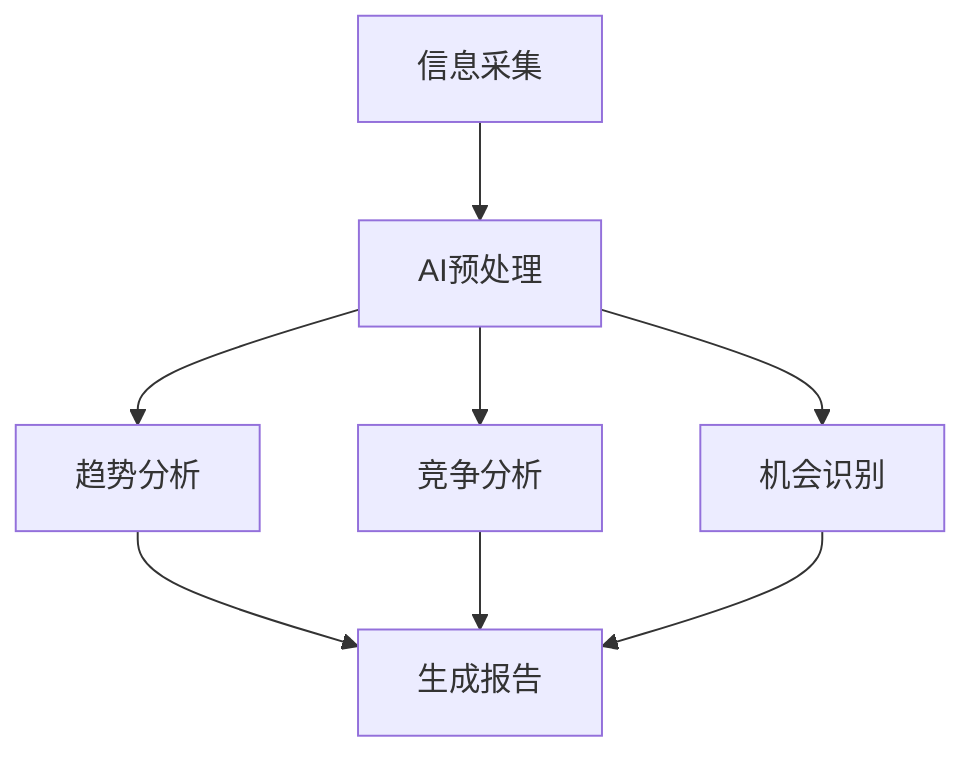

## 🎉 欢迎来到AI行业观察站！

很高兴你来到这里！这是一个全新的尝试——一个完全由AI驱动、自动更新的行业分析博客。

### 🤔 为什么创建这个博客？

在信息爆炸的时代，我们每天面对海量的行业资讯，但：
- 信息分散，难以系统化
- 分析深度不够，停留在表面
- 缺乏持续跟踪和趋势判断

**AI行业观察站**旨在解决这些问题：
- ✅ 自动搜集各行业关键信息
- ✅ AI深度分析和洞察
- ✅ 持续跟踪趋势变化
- ✅ 结构化呈现结果

### 🚀 今天开始，你将获得：

1. **每日行业简报**
   - 科技、金融、教育、医疗等关键领域
   - 重要事件和趋势分析
   - 数据支持和图表展示

2. **深度分析报告**
   - 每周行业深度分析
   - 竞争格局变化
   - 投资机会洞察

3. **趋势预测**
   - 基于数据的趋势判断
   - 风险预警
   - 机会提示

### 📊 今日示例：AI行业动态

*（以下为示例内容，展示未来的分析格式）*

#### **1. 大模型进展**
- **OpenAI发布GPT-5测试版**：在多模态理解和推理能力上有显著提升
- **国内大模型竞争加剧**：多家公司推出千亿参数模型
- **成本下降趋势**：推理成本较年初下降30%

#### **2. 应用层创新**
- **AI编程助手普及**：GitHub Copilot用户突破1000万
- **数字人直播爆发**：电商领域AI主播占比达15%
- **教育AI落地**：个性化学习系统覆盖2000所学校

#### **3. 投资趋势**
- **VC投资偏好**：应用层>基础设施>基础模型
- **并购活跃**：大厂加速收购AI初创公司
- **估值调整**：早期项目估值回归理性

### 🔍 分析方法论

我们的分析基于：
1. **多源数据采集**：权威媒体、行业报告、社交平台
2. **AI语义理解**：提取关键信息，识别趋势模式
3. **交叉验证**：多个数据源对比，确保准确性
4. **专家知识库**：结合行业专家经验模型

### 📈 数据可视化示例

### 🎯 未来规划

1. **增加行业覆盖**：从5个扩展到10+个行业
2. **个性化推荐**：根据读者兴趣定制内容
3. **数据API**：开放数据接口供开发者使用
4. **移动应用**：开发专属App，推送提醒

### 🤝 参与方式

1. **订阅更新**：每天自动获取最新分析
2. **反馈建议**：帮助我们改进分析质量
3. **内容合作**：欢迎行业专家投稿
4. **技术贡献**：开源项目，欢迎PR

---

**明日预告**：科技行业Q1趋势分析，重点关注AI芯片和云计算领域。

*本博客内容由AI生成，结合多源数据分析和专家知识库。仅供参考学习，不构成投资建议。*

---
*更新时间：2026-02-01 23:06*
*分析模型：GPT-4 + 行业知识库*
*数据来源：36氪、虎嗅、行业报告等*